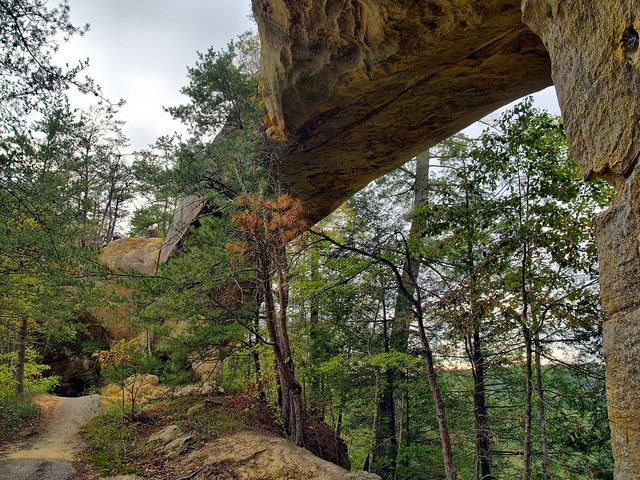
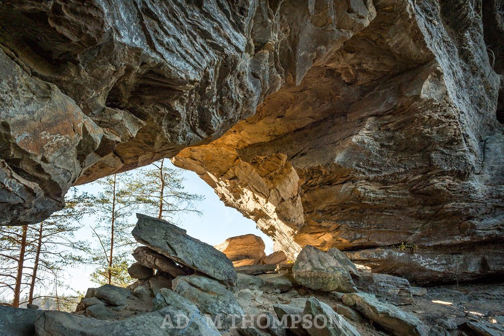
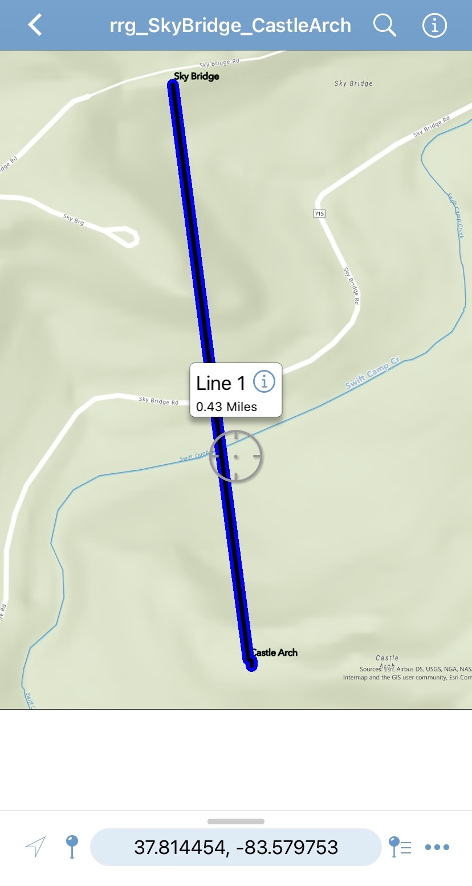

# rrg

Kentucky's Red River Gorge National Geological Area

## A Base map of Arches in Red River Gorge

[Download a GeoPDF of Arches in Red River Gorge](basemap/rrg.pdf)

## A Base map of Sky Bridge and Castle Arch in Red River Gorge

[Download a GeoPDF of of Sky Bridge and Castle Arch](basemap/rrg_SkyBridge_CastleArch.pdf)

 
*Looking up at Sky Bridge*, photo by William Fultz II

 
*Under Castle Arch*, photo by Adam Thompson

 
*Basemap in Application*, photo by Greg Madden

https://gmadd89.github.io/rrg/