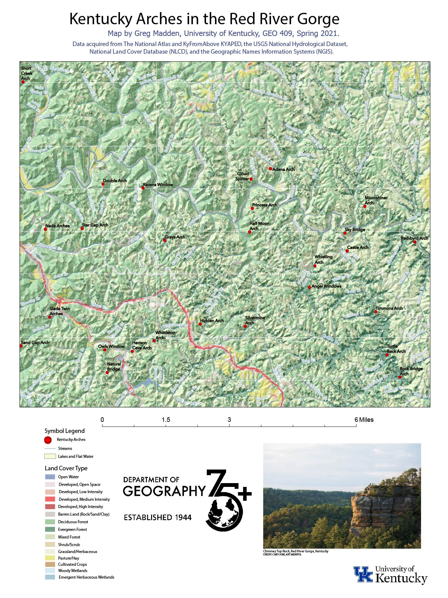
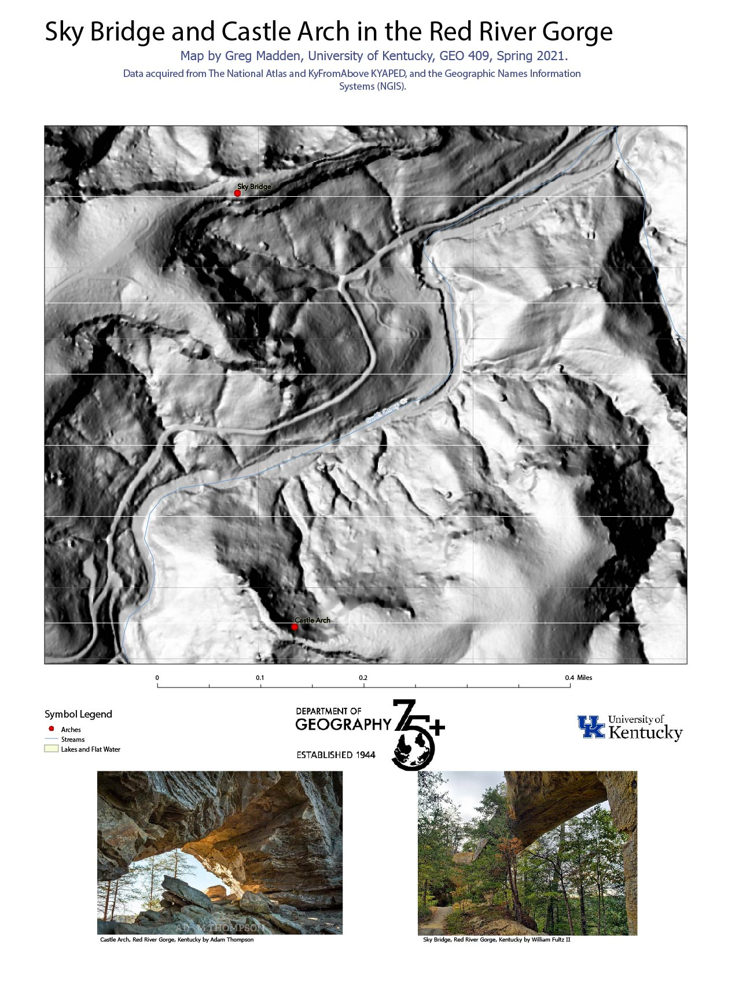
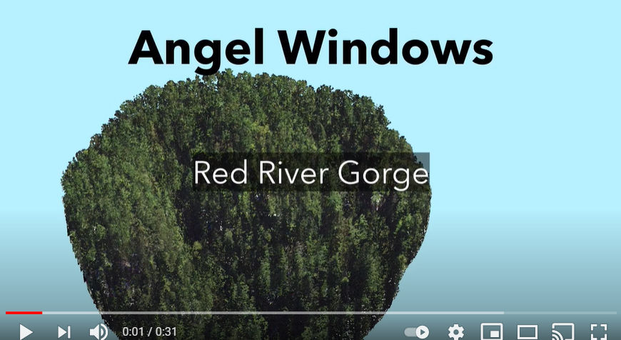
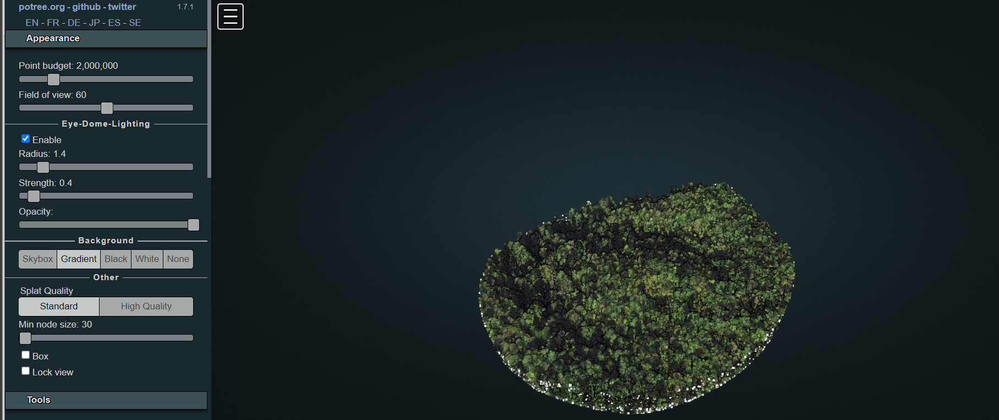

# rrg

Kentucky's Red River Gorge National Geological Area

## A Base map of Arches in Red River Gorge.

[Download a GeoPDF of Arches in Red River Gorge](basemap/rrg.pdf)

## An image of GeoPDF
 

## A map of Sky Bridge and Castle Arch in Red River Gorge.

[Download a GeoPDF of of Sky Bridge and Castle Arch](basemap/rrg_SkyBridge_CastleArch.pdf)

## An image of GeoPDF for Sky Bridge and Castle Arch.
 

## A 3D Map of Angel Windows.

## Animation.

[Angel Windows Animation Link](https://youtu.be/fGuwhO51KOk)

Web page at: [https://gmadd89.github.io/rrg/](https://gmadd89.github.io/rrg/)

## Interactive Map.

[link to Potree point cloud render](potree)